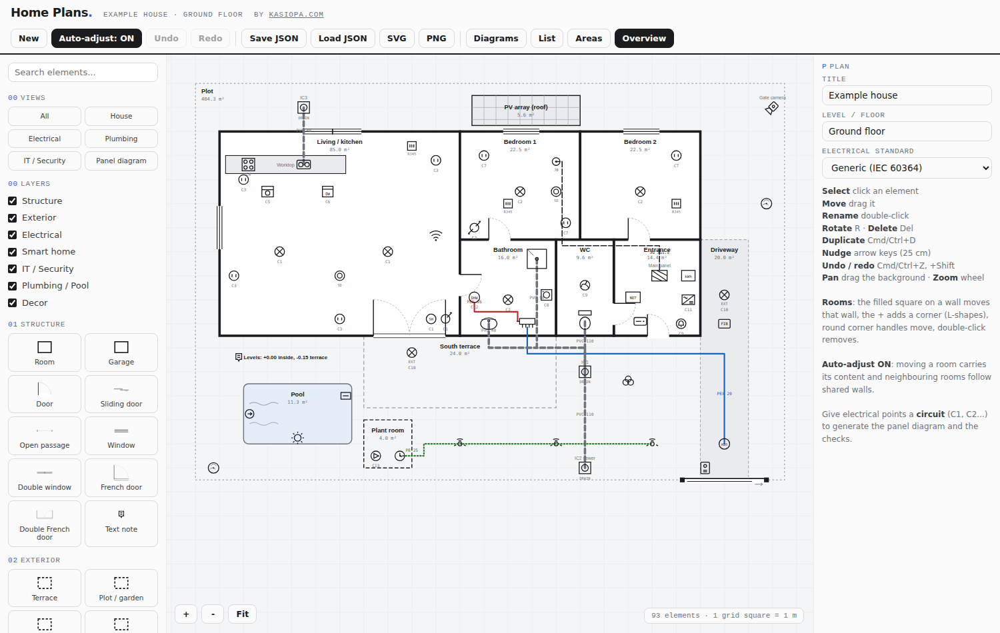
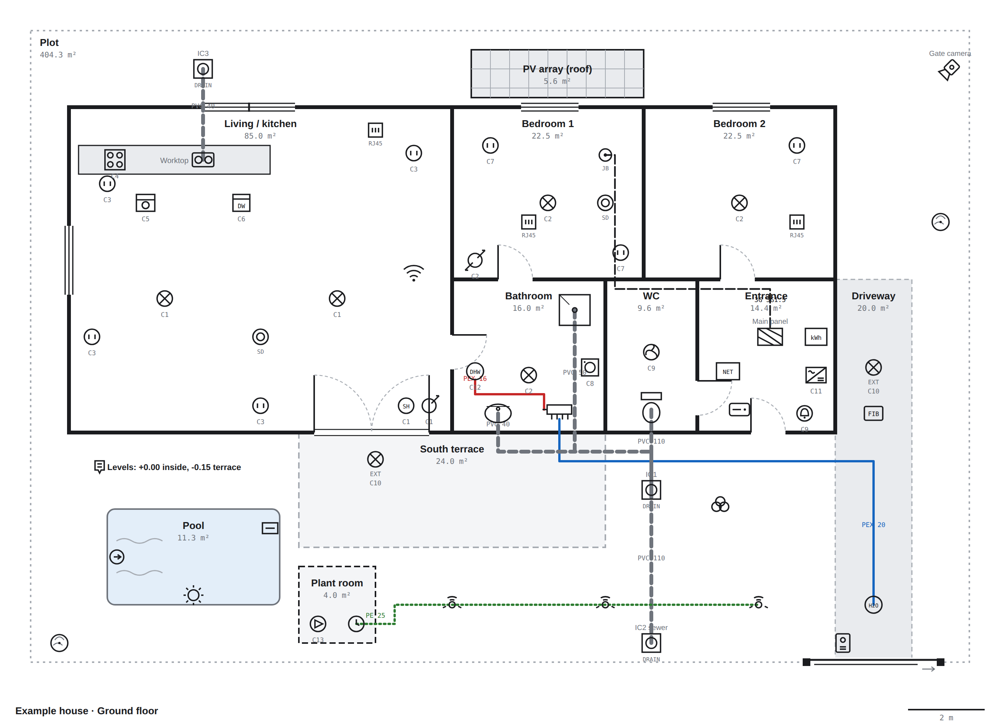
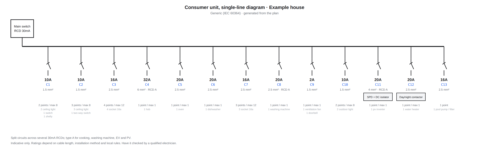

# Kasiopa Home Plans

An open-source [Agent Skill](https://docs.claude.com/en/docs/agents-and-tools/agent-skills/overview) that lets Claude draw 2D home floor plans and all their technical networks, then hand them over as a single offline HTML editor you can keep editing yourself.

Describe your home, upload a photo or a hand sketch, and get back: rooms, doors and windows, sockets and lights with their circuits, cables with cross-sections, the consumer unit single-line diagram, smart home modules, network and cameras, water supply, drains and inspection chambers, irrigation, pool, solar, kitchen and garden.

Claude talks to you in your language (English, French, Spanish, German, Italian and more) and uses the electrical standard of your country: NF C 15-100 (France), REBT (Spain), BS 7671 (UK) or a generic IEC 60364 profile.



## What you get

- **An editor in one HTML file.** No install, no server, no account, works offline. Layers and trade views (house, electrical, plumbing, IT), drag and drop, undo/redo, L-shaped rooms, walls you can drag with neighbouring rooms following, target areas in m², notes on every element, auto-save in the browser, export to JSON, SVG, PNG and CSV.
- **A consumer unit diagram generated from the plan**, with breaker ratings, cross-sections, RCD types and extra modules according to the chosen standard, plus typical wiring diagrams (two-way switching, smart relay behind a switch).
- **Built-in checks**: too many points on a circuit, lighting and sockets mixed, elements outside any room, cables without cross-section, overlapping or stacked rooms, water points without a drain.
- **Photo and sketch digitizing**: Claude numbers every room and element it sees and asks precise questions about the doubtful ones before drawing.
- **Scripts for the agent**: build the editor with a plan inside, validate a plan, render it to PNG exactly as the editor draws it.

| Example plan | Panel diagram |
|---|---|
|  |  |

## Install

**Claude apps (claude.ai, desktop):** download the latest release zip (or zip the `kasiopa-home-plans` folder), then Settings > Capabilities > Skills > Upload skill.

**Claude Code:** copy the folder into `~/.claude/skills/` (personal) or `.claude/skills/` (project).

```bash
git clone https://github.com/kasiopajg/kasiopa-home-plans.git ~/.claude/skills/kasiopa-home-plans
```

**Claude API / Agent SDK:** upload the folder as a custom skill, see the Agent Skills documentation.

Then just ask, for example:

> Here is a sketch of my flat. Draw the plan and propose the electrical circuits for a full renovation in France.

> Dibújame el plano de la planta baja con la red de saneamiento y las arquetas.

## Use the editor without Claude

Open `assets/editor.html` in any modern browser. It starts with the example plan; use **New** for an empty one. Your work is saved in the browser automatically; use **Save JSON** to keep a file and **Load JSON** to reopen it.

Shortcuts: click to select, drag to move, double-click to rename, `R` rotate, `Delete` remove, `Cmd/Ctrl+D` duplicate, arrows nudge 25 cm, `Cmd/Ctrl+Z` undo, `Cmd/Ctrl+Shift+Z` redo, mouse wheel to zoom, drag the background to pan.

## Repository layout

```
kasiopa-home-plans/
  SKILL.md                  instructions Claude follows
  assets/editor.html        the editor (single file, no dependencies)
  assets/example-plan.json  complete example plan
  scripts/build_editor.py   embed a plan into a copy of the editor
  scripts/validate_plan.py  validate a plan (structure, geometry, networks)
  scripts/render_plan.py    render to PNG/SVG and print the editor checks
  references/               JSON format, electrical standards, networks, glossary
  docs/                     screenshots
```

Scripts need Python 3.8+. `render_plan.py` uses Playwright with Chromium when available (`pip install playwright && playwright install chromium`) and falls back to a simplified renderer otherwise (`pip install cairosvg` for PNG).

## Plan format

Plain JSON, 1 m = 50 px. See [references/json-format.md](references/json-format.md). Plans made with the first French version of the skill (`plans-maison-reseaux`, types such as `prise`, `tableau`, `jardin`) open unchanged.

## Disclaimer

This project helps you understand, plan and communicate. It is not an electrical design tool and does not certify anything. Ratings and limits are indicative and standards change: fixed wiring, consumer units and gas work must be designed, carried out and certified by qualified professionals according to the rules where you live.

## Contributing

Issues and pull requests are welcome: new symbols, other national standards, translations of the glossary, bug reports with the plan JSON attached. Keep the editor a single dependency-free file and run `scripts/validate_plan.py assets/example-plan.json` before submitting.

## License

MIT, see [LICENSE](LICENSE). Created by Damien Moras, [kasiopa.com](https://kasiopa.com).
